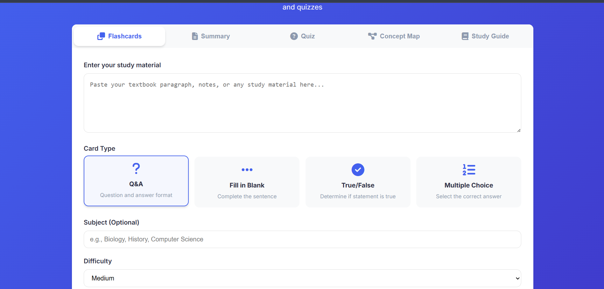
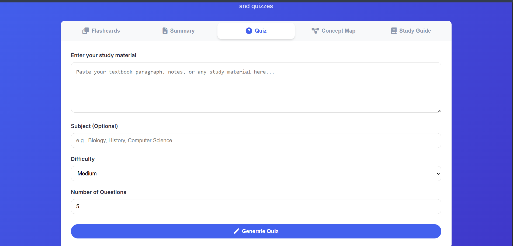
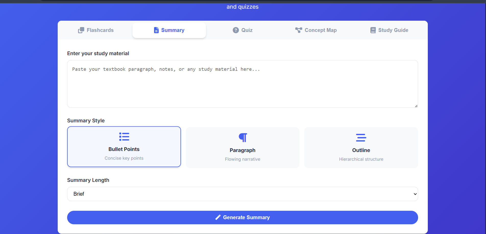
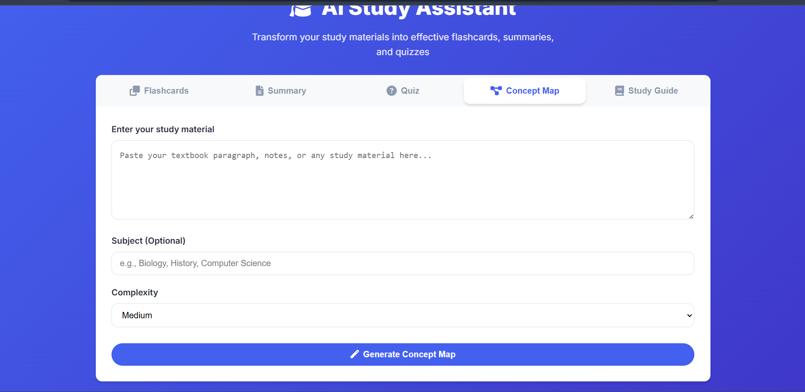

# 🎓 AI Study Assistant

<div align="center">
  
  
  
  

  <p align="center">
    <b>Transform your study materials into effective learning tools with AI</b><br>
    <i>Generate flashcards, summaries, quizzes, concept maps, and study guides instantly</i>
  </p>

  <a href="#-features"></a>
  <a href="#-quick-start"></a>
  <a href="#-api-documentation"></a>
  <a href="#-usage"></a>
</div>

---

## ✨ Features

### 📚 Learning Tools

1. **Flashcard Generator**
   - Q&A card format
   - Adjustable difficulty levels
   - Smart explanations for each card
   - Download as JSON

2. **Smart Summarizer**
   - Bullet points, paragraph, or outline formats
   - Brief or detailed summaries
   - Key points extraction
   - Copy to clipboard or download as text

3. **Quiz Creator**
   - Auto-generated questions from content
   - Multiple choice, true/false, and short answer questions
   - Instant feedback with explanations
   - Scoring system

4. **Concept Map Generator**
   - Visual representation of key concepts
   - Relationship mapping
   - Interactive SVG visualization
   - Download as SVG

5. **Study Guide Creator**
   - Comprehensive topic breakdown
   - Definitions and explanations
   - Practice questions
   - Review checklists
   - Study tips

### 🚀 Key Capabilities

- **AI-Powered**: Uses advanced AI models via API for intelligent content generation
- **Interactive UI**: Flip cards, take quizzes, explore concept maps
- **Export Options**: Download study materials in various formats
- **Responsive Design**: Works on all devices
- **No Installation Required**: Runs directly in your browser

## 🛠️ Tech Stack

| Component | Technology | Purpose |
|-----------|------------|---------|
| **Backend API** | Hosted on Railway | AI-powered content generation |
| **Frontend** | HTML/CSS/JS | Interactive, responsive interface |
| **Visualization** | SVG | Dynamic concept maps |
| **Deployment** | Static HTML | Simple to host anywhere |

## 🚀 Quick Start

### Prerequisites
- A modern web browser (Chrome, Firefox, Safari, Edge)
- Internet connection to access the API

### Local Setup

1. **Clone the repository**
   ```bash
   git clone https://github.com/omara2001/AI-Study-Assistant.git
   cd ai-study-assistant
   ```

2. **Open the application**
   Simply open the `index.html` file in your web browser:
   ```bash
   # On Windows
   start index.html

   # On macOS
   open index.html

   # On Linux
   xdg-open index.html
   ```

3. **Start using the application**
   - Enter your study material in any of the tool tabs
   - Configure options as needed
   - Generate your study materials with the AI

## 📖 API Documentation

### Endpoints

| Endpoint | Method | Description |
|----------|--------|-------------|
| `/generate-flashcards` | POST | Generate flashcards from text |
| `/summarize` | POST | Create summaries |
| `/create-quiz` | POST | Generate quiz questions |
| `/concept-map` | POST | Create concept maps |
| `/study-guide` | POST | Generate study guides |
| `/health` | GET | Check API health status |

### Example Requests

#### Generate Flashcards
```json
{
  "text": "The mitochondria is the powerhouse of the cell...",
  "subject": "Biology",
  "difficulty": "medium",
  "count": 5,
  "card_type": "qa",
  "include_explanations": true
}
```

#### Create Summary
```json
{
  "text": "Long text content...",
  "style": "bullet_points",
  "length": "brief"
}
```

#### Generate Quiz
```json
{
  "text": "Study material...",
  "question_count": 10,
  "question_types": ["multiple_choice", "true_false", "short_answer"],
  "difficulty": "medium"
}
```

#### Generate Concept Map
```json
{
  "text": "Study material...",
  "max_concepts": 10,
  "show_relationships": true
}
```

#### Generate Study Guide
```json
{
  "text": "Study material...",
  "subject": "Biology",
  "focus_areas": ["structure", "replication", "function"],
  "include_examples": true
}
```

## 🧩 Usage

### How to Use Each Feature

1. **Flashcards**
   - Enter your study material in the text area
   - Select the difficulty level and number of cards
   - Click "Generate Flashcards"
   - Use the navigation buttons to flip through cards
   - Download your flashcards as JSON

2. **Summaries**
   - Enter your text in the summary tab
   - Choose a summary style (bullet points, paragraph, or outline)
   - Select the length (brief or detailed)
   - Click "Generate Summary"
   - Copy or download the generated summary

3. **Quizzes**
   - Enter your study material
   - Select the number of questions and difficulty
   - Click "Generate Quiz"
   - Answer the questions and check your score
   - Reset the quiz to try again

4. **Concept Maps**
   - Enter your study material in the concept map tab
   - Click "Generate Concept Map"
   - Explore the visual representation of concepts and their relationships
   - Download the concept map as an SVG file

5. **Study Guides**
   - Enter your study material in the study guide tab
   - Specify the subject (optional)
   - Click "Generate Study Guide"
   - Review the comprehensive guide with key concepts, examples, and practice questions
   - Download or copy the study guide

## 🎯 Use Cases

### For Students
- **Exam Preparation**: Convert textbooks into flashcards
- **Quick Reviews**: Generate summaries of lecture notes
- **Self-Testing**: Create practice quizzes
- **Visual Learning**: Build concept maps

### For Educators
- **Course Material**: Generate study guides
- **Assessment**: Create quiz questions
- **Teaching Aids**: Build concept maps
- **Review Sessions**: Prepare flashcard sets

### For Professionals
- **Certification Study**: Prepare for professional exams
- **Skill Development**: Learn new technologies
- **Knowledge Retention**: Regular review with flashcards
- **Training Materials**: Create learning resources

## 📸 Screenshots

<div align="center">
  <table>
    <tr>
      <td width="50%">
        
        <p align="center"><b>Flashcard Generator</b></p>
      </td>
      <td width="50%">
        
        <p align="center"><b>Quiz Creator</b></p>
      </td>
    </tr>
    <tr>
      <td width="50%">
        
        <p align="center"><b>Smart Summarizer</b></p>
      </td>
      <td width="50%">
        
        <p align="center"><b>Concept Map Generator</b></p>
      </td>
    </tr>
  </table>
</div>

## 🔧 Configuration

### Environment Variables

| Variable | Description | Required |
|----------|-------------|----------|
| `GEMINI_API_KEY` | Google Gemini API key | ✅ |
| `PORT` | Server port (auto-set by Railway) | ❌ |

### Customization Options

- **Card Templates**: Modify flashcard formats in the backend
- **UI Theme**: Adjust colors and styles in the frontend
- **Question Types**: Add new quiz question formats
- **Export Formats**: Support additional file types

## 🤝 Contributing

1. Fork the repository
2. Create your feature branch (`git checkout -b feature/amazing-feature`)
3. Commit changes (`git commit -m 'Add amazing feature'`)
4. Push to the branch (`git push origin feature/amazing-feature`)
5. Open a Pull Request

## 📊 Current Features

| Feature | Status | Description |
|---------|--------|-------------|
| Flashcard Generation | ✅ | Generate Q&A flashcards with explanations |
| Summaries | ✅ | Create bullet points, paragraph, or outline summaries |
| Quizzes | ✅ | Generate multiple choice, true/false, and short answer questions |
| Concept Maps | ✅ | Create visual concept maps with relationships |
| Study Guides | ✅ | Generate comprehensive study guides with key concepts |
| Export Options | ✅ | Download as JSON, text, or SVG depending on the feature |

## 📈 Potential Future Enhancements

- [ ] User accounts and progress tracking
- [ ] Spaced repetition system for flashcards
- [ ] Collaborative study groups
- [ ] Import from PDFs and images
- [ ] Additional export formats
- [ ] Mobile app version
- [ ] Voice explanations
- [ ] Multi-language support
- [ ] Integration with learning platforms

## 🐛 Troubleshooting

<details>
<summary><b>Common Issues</b></summary>

### API Connection Issues
- Check your internet connection
- Verify the API server is running (health check)
- Try refreshing the page

### Content Generation Problems
- Try with shorter text segments
- Check text formatting (remove special characters)
- Ensure you're using English text

### UI Issues
- Clear browser cache
- Check browser console for errors
- Ensure JavaScript is enabled
- Try a different modern browser

</details>

## 💡 Tips for Best Results

### Creating Effective Flashcards
- Use clear, concise text
- Include context in your input
- Specify the subject for better results
- Choose appropriate difficulty levels

### Getting Better Summaries
- Provide well-structured input text
- Choose the right summary style
- Adjust length based on content

### Optimizing Quiz Generation
- Include diverse content
- Specify question types needed
- Balance difficulty levels

## 📄 License

This project is licensed under the MIT License - see the [LICENSE](LICENSE) file for details.

## 🙏 Acknowledgments

- **Railway** - Hosting the API endpoints
- **AI Models** - Powering the content generation
- All students and educators who inspired this project

---

<div align="center">
  <p>
    <b>Built with ❤️ to make learning more effective</b><br>
    <sub>If you find this helpful, please give it a ⭐</sub>
  </p>
</div>
